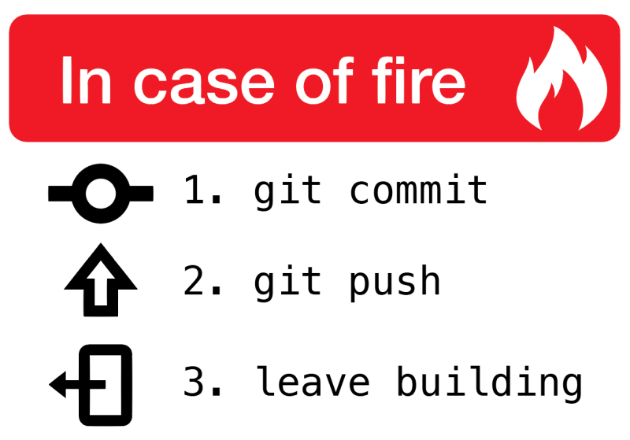
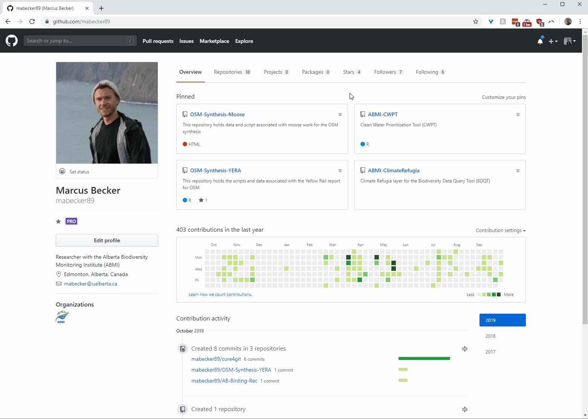
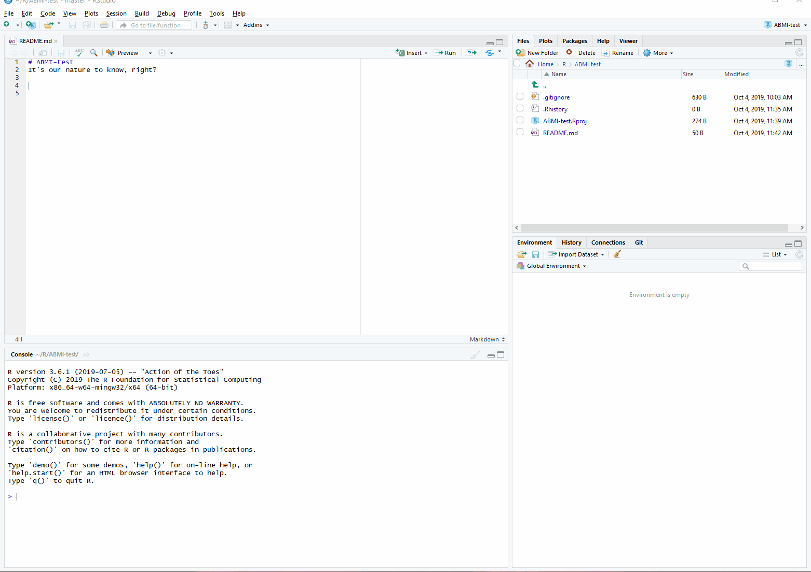

```{r setup, include = FALSE}

options(htmltools.dir.version = FALSE)

library(knitr)

opts_chunk$set(
  fig.align="center", #fig.width=6, fig.height=4.5, 
  # out.width="748px", #out.length="520.75px",
  dpi=300, #fig.path='Figs/',
  cache=T#, echo=F, warning=F, message=F
  )

```

# Outline of these workshops

### Workshop 1 (October 17, 2019)

1. [Prologue](#prologue)

  .font80[What are we doing here?]

1. [Git](#git)

  .font80[Version Control, baby!] 
  
1. [Github](#github)

  .font80[Makes our lives easy.]

1. [Git(hub) and RStudio](#rstudio)

  .font80["Hello World!"]

1. [Shell](#shell)

  .font80[Looks scary (but isn't.)]

---

# Outline of these workshops

### Workshop 2 (October 24, 2019)

- Troubleshoot some setup issues. 

- Go through some more advanced Git operations and workflows.


### Workshop 3 (If desired; TBD)

- Discuss practices and procedures for using Git in ABMI workflow

  + Github organization, teams, and permissions.
  + Projects to start with.

---
class: inverse, center, middle
name: prologue

# Prologue

<html><div style='float:left'></div><hr color='#EB811B' size=1px width=796px></html>

---

# Prologue

### The Highest Ideal

> *The goal is a collaborative, transparent, and efficient approach to our scientific and computational work at the ABMI.* 


<br>
Part of this process will be figuring out how best to structure a collaborative culture within the organization (and with external partners).

We want to operationalize the **reproducibility** of our research.

We want staff to **collaborate** and learn from one another. 

<br>

So there isn't a 'right' way for now, but hopefully it will develop over time where staff from all corners of the organization can contribute to and review the scientific products we generate.  

---

# Going Forward

**The Plan** (capital T capital P) is to:

1. Build skills with Git software among staff:

  + Develop curated list of Help resources;
  + Develop a nucleus of staff who can consistently provide support to others;
  + Meet (semi-) regularly to continue skill development. 

1. Introduce Git to the workflow of a few projects identified as good candidates.

1. Over time, build our analyses using git as a collaboration tool and version control backstop, accessible by others both within and outside of the organization.

  ... something, something ...
  
--

1. Conquer the world!! 

---
class: inverse, center, middle
name: git

# Intro to Git
<html><div style='float:left'></div><hr color='#EB811B' size=1px width=796px></html>
---

# Why bother?

<div align="center">

</div>

---

# Git (in theory)

A **version control system** is a tool that manages changes made to files and directories in a project.

Many exist, but we'll focus on a particularly powerful one: **Git**.
> If Dropbox and Word's *Track Changes* feature had a baby, Git would be that baby.

Git manages the evolution of a set of files in a highly structured way. 

--
<br>
<br>
Why's it useful?

+ Nothing that is saved to Git is ever lost, unless you work really hard at it.
+ Git can synchronize work done by different people on different machines, and notify you when your work conflicts with someone else's. 
+ Well designed for writing and tracking changes to code ... something we all tend to do a lot of here. 

---

# Key Git Terms

### **Repository**

Git projects have two parts: the files and directories you create and edit directly, and the extra information that Git records about the project's history. 

The combination of these two things is called a *repository*, or 'repo' as the cool kids like Peter say. 

### **Stage** (or "add") and **Commit**

Git has a *staging area* in which it stores files with changes you want to save, but haven't been saved yet.
  
  > It's like putting things in a box that you intend to mail out. 
  
*Commiting* those changes is like putting that box in the mail. Your changes are saved into the history of your local repo. 

---

# Key Git Terms

### **Pull**/**Push**<sup>1</sup>

Repositories can be local (on your machine) or *remote*, i.e. hosted online by a service like Github (which we'll chat about tout de suite ...)

A typical workflow:

  + You *pull* in your collaborators' work from a remote repository so that you have the latest version of everything.
  + You do some work.
  + You *push* your work back to the remote repository so that your collaborators can access it. 

.footnote[
<sup>1</sup> These two commands were intentionally ordered in this way - it's good practice to Pull before you start work on a project, then Push when you're finished, even if you're working alone. If (when) you forget, there will be pain. Best to get in the habit.]

---

# Key Git Terms

### Many others ...

<br>
Conflicts

Branches

Forking

<br>
But we'll save these concepts for the next workshop(s).

---

# Git (in practice)

<div align="center">

</div>

---

# Git (in practice)

<div align="center">

</div>

(First you should `git add .` I think ...)

---
class: inverse, center, middle
name: github

# Github
<html><div style='float:left'></div><hr color='#EB811B' size=1px width=796px></html>
---

# Github

**Git and Github are distinct things.**

  + [Github](https://www.github.com) is an online hosting platform that provides an array of services built on top of the Git system<sup>1</sup>.
  
  + We can create, manage permissions to, and store our files in repositories hosted by Github.
  
  + Just like we don't *need* RStudio to run R code, we don't *need* Github to use Git - but it makes our lives much easier.
  
<div align="center">

</div>

.footnote[
<sup>1</sup> Other examples are Gitlab and Bitbucket.]

---

# Git(hub) for Scientific Research

In addition to the benefits of rigorous version control and collaboration tool, Git(hub) also helps to operationalize the ideals of open science and reproducibility.

  +  *Nature:* [Democratic databases: science on GitHub](https://www.nature.com/news/democratic-databases-science-on-github-1.20719) (Perkel, 2016).
  + *PLOS:* [Ten Simple Rules for Taking Advantage of Git and Github](https://journals.plos.org/ploscompbiol/article?id=10.1371/journal.pcbi.1004947) (Perez-Riverol et al 2016)
  
Journals are increasingly moving towards stricter requirements regarding reproducibility and data access. 

  + No more frustrating reads of a tiny Methods section in a dusty old pdf file of a paper where you're trying desparately to understand what they did, step-by-step (.. *breathes heavily* ..).
  + You can host all the data, code, and writing for papers, projects, and/or reports in one place. Even [workshop materials](https://github.com/mabecker89/cure4git).

---
class: inverse, center, middle
name: setup

# Setup
<html><div style='float:left'></div><hr color='#EB811B' size=1px width=796px></html>
---

# Getting Started

<div align="center">

</div>

> Much like the battle of Helm's Deep, this will likely involve some up front pain. But you will emerge victorious.  

---

# Getting Started

.font80[Note: there are a ton of great Git resources online to you walk you through this process in depth. A bunch are listed in the [Resources](#resources) section at the back of this presentation and in the workshop's repo [README file](https://github.com/mabecker89/cure4git/blob/master/README.md), many of which are heavily borrowed from for this presentation.] 

### Register for a [Github](www.github.com) account.

  - It's free! Don't worry about the paid accounts for now<sup>1</sup>.

### Install Git on your local machine.

  - Depends on the OS you're running, but we'll assume Windows for this tutorial.
  - [Git for Windows](https://gitforwindows.org/), aka 'Git Bash', is a recommended approach.
  
.footnote[
<sup>1</sup> You'll qualify for an educational account while you work for ABMI/UofA.]
  
---

# Getting Started

### Introduce yourself to Git.

Directly in the Shell (Git Bash):

```bash
$ git config --global user.name 'Marcus Becker'
$ git config --global user.email 'mabecker@ualberta.ca'
```
  
Or through R:

```{r}
# install.packages("usethis")
  
library(usethis)
use_git_config(user.name = "Marcus Becker", 
               user.email = "mabecker@ualberta.ca")
```

<br>
<br>
Tips: Use your (real) full name, and the email associated with your Github account. 

---
class: inverse, center, middle
name: rstudio

# Git(hub) and RStudio
<html><div style='float:left'></div><hr color='#EB811B' size=1px width=796px></html>
---

# Seamless Integration 

A wonderful aspect of RStudio is how well it integrates version control into your project workflow.

Git is a separate program to R, but RStudio connects them so well that you feel they are part of the same ecosystem.

You can use Git through the RStudio GUI, and in the background it executes the shell commands for you.

--

<br>

> Because of how easy it is<sup>1</sup>, we'll introduce the use of Git through RStudio in this next section.

.footnote[
<sup>1</sup> There are reasons why working with Git through RStudio is limiting. We'll touch on those next time when we work through some more advanced concepts.]

---

# General Recipe

.font80[*For new projects*]

1. Create a repo on GitHub and initialize with a README.

1. Copy the HTTPS/SSH link (the green "Clone or Download" button).

1. In RStudio, create a new Project using the following steps: 

  `File -> New Project... -> Version Control -> Git` 
  
  and **clone** the repo to your local machine by pasting your copied link into the "Repository URL:" box.
  
1. Choose the project path (be intentional!) and click **Create Project**. 

<br>
> See the gif walkthrough on the next slide.

---

# General Recipe

<div align="center">

</div>

---

# General Recipe

We've now cloned a remote repo from Github onto our local machine. Yay!

Remember those important command terms? (**Stage, Commit, Pull**, and **Push**) <br>
Let's execute them (Well, let RStudio execute them for us). 

.font90[1. Make a change to the repo README in RStudio ("Hello World!"). Save it.

1. Click the 'Git' tab in the `Environments, History, Connections .. ` pane.

1. Click `Commit`.

1. Click the `Stage` checkbox of the change you want to commit. 

  + You'll see a nice display of the changes you've either added (green) or deleted (red).

1. Write a `Commit message`. Be detailed. You never know when you'll need to know what you did in a particular commit. Commit the change.

1. Click `Pull` to retrieve any changes made by you or a collaborator in the upstream Github repo.

1. Click `Push`, which will send your changes to the remote repo on Github.] 

---

# General Recipe

<div align="center">

</div>

---

# Recap

### What did we just do?

.font80[
+ Made some changes to a file locally ("Look at this wonderful work I've done!")
+ Staged these changes ("These are the wonderful changes I've made!")
+ Committed these local changes to our Git history ("Yes, I'm sure I want these changes.")
+ Pulled from the remote repo upstream (good practice)
+ Pushed our shiny new changes out into the remote repo, accessible to our collaborators ("Look at my wonderful work!")
]

### Why this workflow?

.font80[
+ Allows Github to act as the central node in the distributed version control network.
+ Copying project from Github to your machine automatically sets up the local Git repo for you.
+ RStudio Projects interact seamlessly with Git and Github.
  - .RProj file acts as an anchor point for all other files in the repo, solving absolute vs. relative path problems<sup>1</sup>.
  ]

.footnote[
<sup>1</sup> .font80[Please don't call files from `"YourComputer/YourName/Documents/SpecialPlace/Sub-Folder/myfile"` in your scripts. An angel loses its wings every time you do. Try `"./myfile"` instead :)]]

---

# Other Workflows

<br>
<br>
.font120[New Project, Github First]
+ *This is what we just did.*

<br>
.font120[[Existing Project, Github First](https://happygitwithr.com/existing-github-first.html)]

<br>
.font120[[Existing Project, Github Last](https://happygitwithr.com/existing-github-last.html)]

---
class: inverse, center, middle
name: shell

# Shell
<html><div style='float:left'></div><hr color='#EB811B' size=1px width=796px></html>
---

# Git from the shell

What's RStudio doing in the background? 

It's executing a series of commands for you. But you can do these yourself.

Why bother with the shell?

+ The shell is more powerful and flexible. You can do more.
+ Potentially more appropriate for projects that aren't (entirely) based in R.
--
<br>
+ **You feel like a programming badass.** 

---

# Git from the shell (1)

<span style="color:black">**1. Create a repo on GitHub and initialize with a README.**

<span style="color:black">**2. Copy the HTTPS/SSH link (the green "Clone or Download" button).**

<span style="color:grey">3. In RStudio, create a new Project using the following steps: 

<span style="color:grey">`File -> New Project... -> Version Control -> Git` 
  
  <span style="color:grey">and **clone** the repo to your local machine by pasting your copied link into the "Repository URL:" box.
  
```bash
$ git clone https://github.com/mabecker89/ABMI-test.git
```
  
<span style="color:grey">4. Choose the project path (be intentional!) and click **Create Project**.

<span style="color:black">4. Make this new repo your working directory.

```bash
$ cd ABMI-test
```
---
count: false

# Git from the shell (1)

<span style="color:black">**1. Create a repo on GitHub and initialize with a README.**

<span style="color:black">**2. Copy the HTTPS/SSH link (the green "Clone or Download" button).**

<span style="color:grey">3. In RStudio, create a new Project using the following steps: 

<span style="color:grey">`File -> New Project... -> Version Control -> Git` 
  
  <span style="color:grey">and **clone** the repo to your local machine by pasting your copied link into the "Repository URL:" box.
  
```bash
*$ git clone https://github.com/mabecker89/ABMI-test.git
```
  
<span style="color:grey">4. Choose the project path (be intentional!) and click **Create Project**.

<span style="color:black">4. Make this new repo your working directory.

```bash
*$ cd ABMI-test
```

---
# Git from the shell (2)

<span style="color:grey">5. Make a change to the repo README in RStudio ("Hello World!"). Save it.

```bash
$ echo "Hello World!!" >> README.md
```

<span style="color:grey">6. Click the 'Git' tab in the `Environments, History, Connections .. ` pane.

<span style="color:grey">7. Click `Commit`.

<span style="color:grey">8. Click the `Stage` checkbox of the change you want to commit.

```bash
$ git add -A
```
<span style="color:grey">9. Write a `Commit message`. Be detailed. You never know when you'll need to know what you did in a particular commit. Commit the change.

```bash
$ git commit -m "my very first line to the README"
```
</span>

---
count: false

# Git from the shell (2)

<span style="color:grey">5. Make a change to the repo README in RStudio ("Hello World!"). Save it.

```bash
*$ echo "Hello World!!" >> README.md
```

<span style="color:grey">6. Click the 'Git' tab in the `Environments, History, Connections .. ` pane.

<span style="color:grey">7. Click `Commit`.

<span style="color:grey">8. Click the `Stage` checkbox of the change you want to commit.

```bash
*$ git add README.md
```
<span style="color:grey">9. Write a `Commit message`. Be detailed. You never know when you'll need to know what you did in a particular commit. Commit the change.

```bash
*$ git commit -m "my very first line to the README"
```
</span>

---

# Git from the shell (3)

<span style="color:grey">6. Click `Pull` to retrieve any changes made by you or a collaborator in the upstream Github repo.

```bash
$ git pull
```

<span style="color:grey">7. Click `Push`, which will send your changes to the remote repo on Github.]

```bash
$ git push
```

---
count: false

# Git from the shell (3)

<span style="color:grey">6. Click `Pull` to retrieve any changes made by you or a collaborator in the upstream Github repo.

```bash
*$ git pull
```

<span style="color:grey">7. Click `Push`, which will send your changes to the remote repo on Github.]

```bash
*$ git push
```

--
<br>
### And that's all there is to it. 

... sort of.

We'll go into more depth next time :)

---

```bash
$ git init
```

---

# Repo tips

## README.md

+ You have the option to include a README when you create a repo in Github - do so!
+ README files act as landing pages for the repo, so you can (should) be explicit about the goals of the project/research, how to the run the analysis, etc. 
+ README's are written in [Markdown](https://www.markdownguide.org/), which Github automatically renders nicely for us.

## .gitignore

+ Tell Git what you want to ... ignore.
+ Useful if you have private files you would prefer not to be public (e.g. site location data).
+ Or for very large individual files (>100 MB). These will cause RStudio to 'hang' (i.e. freeze up) when you try to push them to a remote repo<sup>1</sup>, which you don't want.
+ Just a simple text file (save as .gitignore) in which you write the files you want ignored.  

.footnote[
<sup>1</sup> There are [ways to handle large files](https://git-lfs.github.com/) when you're working in the shell, though.]

---
class: inverse, center, middle
name: next

# Next Workshop
<html><div style='float:left'></div><hr color='#EB811B' size=1px width=796px></html>
---

# Next Workshop

Scheduled for October 24, 2019

In the meantime:
+ Make a Github account.
+ Install Git on your local machine.
+ Say hello to Git.
+ Get RStudio and Github talking to one another.

If (when) you run into trouble, holler at me. I will come and sit at your computer and we can troubleshoot together. See the [Resources](#resources) slide for some awesome Git How-To's.

---

# Next Workshop

Scheduled for October 24, 2019

Next time we will:
+ Troubleshoot any issues people had (send me Q's beforehand and I'll go over them). 
+ Introduce some advanced concepts.
+ Discuss potential for incorporating Git into ABMI projects and workflow. 

---
class: inverse, center, middle
name: conquer

# Go forth and conquer
<html><div style='float:left'></div><hr color='#EB811B' size=1px width=796px></html>
---
name: resources

# Resources

[Happy Git and GitHub for the useR](https://happygitwithr.com/)

+ This is an amazing guide, and most of the material in this presentation was borrowed from it. Lots of detail in there about common problems people run into. 

[Software Carpentry - Version Control with Git](https://swcarpentry.github.io/git-novice/)

+ Not explicitly focused on R, but a thorough walkthrough of all Git concepts.

[Git Immersion](http://gitimmersion.com/index.html)

+ A guided tour through the fundamentals of Git.

<br>
**Acknowledgements**

Big thanks to [Jenny Bryan](https://github.com/jennybc) et al for their work on Happy Git with R, as well as [Grant McDermott](https://github.com/grantmcdermott) for inspiration on the slides. 


