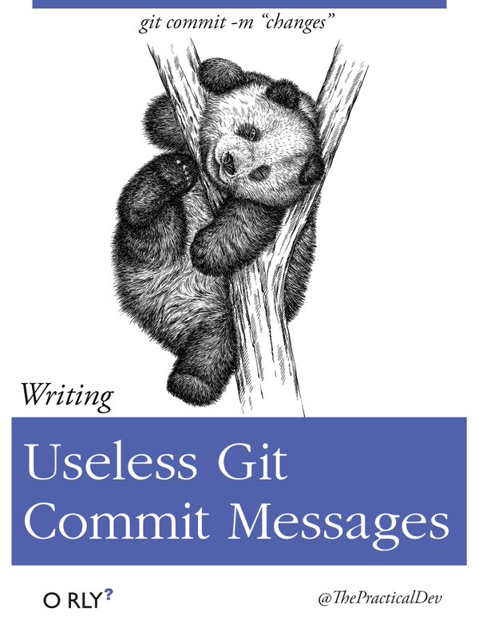

```{r setup, include = FALSE}

options(htmltools.dir.version = FALSE)

library(knitr)

opts_chunk$set(
  #prompt = T,
  fig.align="center", #fig.width=6, fig.height=4.5, 
  # out.width="748px", #out.length="520.75px",
  dpi=300, #fig.path='Figs/',
  cache=T#, echo=F, warning=F, message=F
  )

```

# Why bother?

<div align="center">

</div>

---

# The Pitch

### Our needs as researchers, data scientists, developers, etc:
<br>

.font120[1. A structured way to manage our projects.

2. Ability to experiment with changes, and travel back in time if we need to.

3. Back up our work.]

<br>
<br>
<br>


<div align="center">

</div>

---
count: false

# The Pitch

### Our needs as researchers, data scientists, developers, etc:
<br>

.font120[1. A structured way to manage our projects.

2. Ability to experiment with changes, and travel back in time if we need to.

3. Back up our work.

4. **Collaborate with others.**

5. **Publicize and share our work.**]

<div align="center">


</div>

---
class: inverse, center, middle
name: git

# Intro to Git
<html><div style='float:left'></div><hr color='#EB811B' size=1px width=796px></html>

---

# Git (in theory)

A **version control system** is a tool that manages changes made to files and directories in a project.

Many exist, but we'll focus on a particularly powerful one: **Git**.
> If Dropbox and Word's *Track Changes* feature had a baby, Git would be that baby.

Git manages the evolution of a set of files in a highly structured way.

Originally created to help groups of people develop software.

--

<br>
Why's it useful to us?

+ Nothing that is saved to Git is ever lost, unless you work really hard at it.
+ Synchronizes work done by different people on different machines (i.e., a method to manage a *distributed* workflow)
+ Well designed for writing and tracking changes to code.

---

# Key Git Terms (1)

### **Repository**

Git projects have two parts: the files and directories you create and edit directly, and the extra information that Git records about the project's history. 

The combination of these two things is called a **repository**, or *repo* as the cool kids say. 

### **Commit**

You use Git to take snapshots of all the files in a repository.

When you want to take a snapshot of a file or files, you create a **commit**.

<br>
So [why would I want to do this](https://speakerdeck.com/alicebartlett/git-for-humans?slide=23) silly commit thing instead of just regular 'ol saving?

---

# Commit (cont'd)

When you **commit** a file or files, some information is saved along with the changes to the file:

1. Who
2. When

Plus, you can (should!) add more information about the changes you've made in a **commit message**.

What's this look like?

--

<div align="right">

</div>

---

# Commit (cont'd)

You can also browse the entire **commit history** of a project.

<div align="center">

</div>

---

# Commit (cont'd)

<div align="center">

</div>

---

# Key benefits (so far)

<br>
- Git stores the whole history of your project in a highly structured way.

- You can time travel to previous versions of your project if you need to.

---

# Key Git Terms (2)

### **Remote**

You should back up your work regularly, ideally somewhere geographically distinct from your computer.

With Git, repositories can be local (on your machine) or **remote**, i.e. hosted online by a service like Github (which we'll chat about right away).

How do you interact with a remote repository?

--

### **Clone**

To first retrieve work from a remote, you **clone** the repository onto your local computer.

Now you have a working copy, including the entire project history tracked by Git.

---

# Key Git Terms (2)

### **Pull**/**Push**<sup>1</sup>

Next, you'll want your local version to 'speak' seamlessly with the remote.  

A typical workflow:

  + You **pull** from a remote repository to make sure you have the latest version of everything locally.
  + You do some work, and commit it.
  + You **push** your new commits back to the remote repository so that it's backed up there and your collaborators can access it.

<br>
.footnote[
<sup>1</sup> These two commands were intentionally ordered in this way - it's good practice to Pull before you start work on a project, then Push when you're finished, even if you're working alone. If (when) you forget, there will be pain. Best to get in the habit.] 

---

# Git (in practice)

<div align="center">

</div>

---

# Key benefits (so far)

<br>
- Git stores the whole history of your project in a highly structured way.

- You can time travel to previous versions of your project if you need to.

- **Use remote repositories to back up your project.**

---
class: inverse, center, middle
name: github

# Github
<html><div style='float:left'></div><hr color='#EB811B' size=1px width=796px></html>
---

# Github

**Git and Github are distinct things.**

  + [Github](https://www.github.com) is an online hosting platform that provides an array of services built on top of the Git system<sup>1</sup>.
  
  + We can create, manage permissions to, and store our files in repositories hosted by Github.
  
  + Just like we don't *need* RStudio to run R code, we don't *need* Github to use Git - but it makes our lives much easier.
  
<div align="center">

</div>

.footnote[
<sup>1</sup> Other examples are Gitlab and Bitbucket.]

---

# Github for Scientific Research

In addition to the benefits of rigorous version control and collaboration tool, Git(hub) also helps to operationalize the ideals of open science and reproducibility.

  +  *Nature:* [Democratic databases: science on GitHub](https://www.nature.com/news/democratic-databases-science-on-github-1.20719) (Perkel, 2016).
  + *PLOS:* [Ten Simple Rules for Taking Advantage of Git and Github](https://journals.plos.org/ploscompbiol/article?id=10.1371/journal.pcbi.1004947) (Perez-Riverol et al 2016)
  
Journals are increasingly moving towards stricter requirements regarding reproducibility and data access. 

  + No more frustrating reads of a tiny Methods section in a dusty old pdf file of a paper where you're trying desparately to understand what they did, step-by-step (.. *breathes heavily* ..).
  + You can host all the data, code, and writing for papers, projects, and/or reports in one place. Even [workshop materials](https://github.com/ABbiodiversity/cure4git).

---

# Key benefits

<br>
- Git stores the whole history of your project in a highly structured way.

- You can time travel to previous versions of your project if you need to.

- Use remote repositories to back up your project.

- **Plenty of collaboration tools offered via Github** 

- **Ability to share your work with the world!**

---
class: inverse, center, middle
name: github

# Show-and-tell 
<html><div style='float:left'></div><hr color='#EB811B' size=1px width=796px></html>

---

# Key benefits (ABMI-styles)

<br>

- **Reproducibility**: We're a public organization, and it's important that we're transparent with our science.

- **Institutional knowledge**: We need to have ways to preserve the ongoing work of the organization in the event that staff leave.

- **Documentation**: Github provides easy ways to create keep track of, share, and update documentation.

- **Publicize our sweet projects**: Easily promote and create simple websites (for free!) for our work and projects (e.g., through Github Pages)

---

# Resources

[Happy Git and GitHub for the useR](https://happygitwithr.com/)

+ This is an amazing guide for using Git and R together.

[Software Carpentry - Version Control with Git](https://swcarpentry.github.io/git-novice/)

+ A thorough walkthrough of all Git concepts.

[Git Immersion](http://gitimmersion.com/index.html)

+ A guided tour through the fundamentals of Git.

[Oh Shit, Git!](https://ohshitgit.com/)

+ For when you need a bit of humour during dark Git days.

---

# One last meme

<div align="center">

</div>


