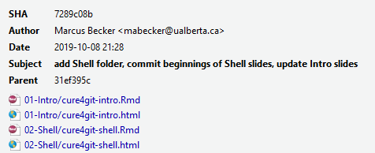
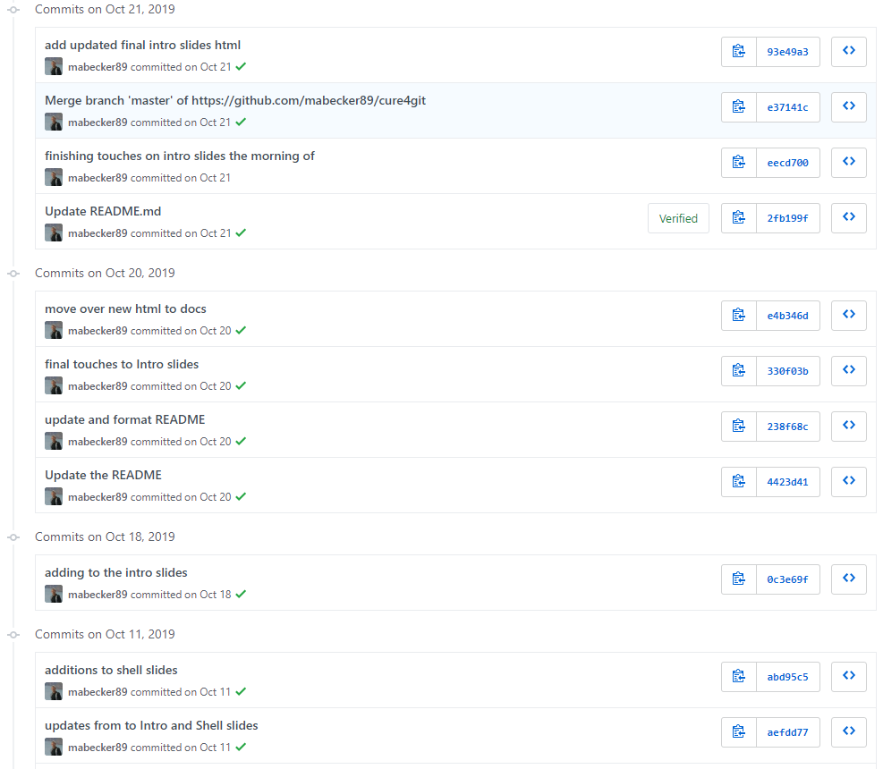

```{r setup, include = FALSE}

options(htmltools.dir.version = FALSE)

library(knitr)

opts_chunk$set(
  #prompt = T,
  fig.align="center", #fig.width=6, fig.height=4.5, 
  # out.width="748px", #out.length="520.75px",
  dpi=300, #fig.path='Figs/',
  cache=T#, echo=F, warning=F, message=F
  )

```

# Outline of this workshop

#### 1. [Recap](#recap)

 What happened last time?
  
#### 1. [Moar Git](#moar)

Conflicts, forks, and branches, oh my!

#### 1. [Useful Github Features](#features)

"Social coding"
  
#### 1. [ABMI on Github](#abmi)

Building our presence

---

class: inverse, center, middle
name: recap

# Recap

<html><div style='float:left'></div><hr color='#EB811B' size=1px width=796px></html>

---

# Git - The Basics

[Slides](https://abbiodiversity.github.io/cure4git/cure4git-intro.html#1) for the first workshop.

+ Git is a **version control system** that manages changes made to files and directories in a project.
+ Originally created to help groups of people develop software.
+ Git manages the evolution of a set of files in a highly structured way.

--

<br>
### Why's it useful to us?

+ Nothing that is saved to Git is ever lost, unless you work really hard at it.
+ Synchronizes work done by different people on different machines (i.e., a method to manage a *distributed* workflow)
+ Well designed for writing and tracking changes to code.
+ Helps us back up, share, and conduct QA on our analyses and products.

---

# Key Git Terms (1)

### **Repository**

Git projects have two parts: the files and directories you create and edit directly, and the extra information that Git records about the project's history. 

The combination of these two things is called a **repository**, or *repo* as the cool kids say. 

### **Commit**

You use Git to take snapshots of all the files in a repository.

When you want to take a snapshot of a file or files, you create a **commit**.

<br>
So [why would I want to do this](https://speakerdeck.com/alicebartlett/git-for-humans?slide=23) silly commit thing instead of just regular 'ol saving?

---

# Commit (cont'd)

When you **commit** a file or files, some information is saved along with the changes to the file:

1. Who
2. When

Plus, you can (should!) add more information about the changes you've made in a **commit message**.

What's this look like?

--

<div align="right">

</div>

---

# Commit (cont'd)

You can also browse the entire **commit history** of a project.

<div align="center">

</div>

---

# Key Git Terms (2)

### **Remote**

With Git, repositories can be local (on your machine) or **remote**, i.e. hosted online by a service like [Github](https://github.com/).

How do you interact with a remote repository?

--

### **Clone**

To first retrieve work from a remote, you **clone** the repository onto your local computer.

Now you have a working copy, including the entire project history tracked by Git.

---

# Key Git Terms (2)

### **Pull**/**Push**

Next, you'll want your local version to 'speak' seamlessly with the remote.  

A typical workflow:

  + You **pull** from a remote repository to make sure you have the latest version of everything locally.
  + You do some work, and commit it.
  + You **push** your new commits back to the remote repository so that it's backed up there and your collaborators can access it.

--

<br>
[Let's walk through the process!](https://github.com/beallen/lotic-connectivity_2019-06-07)

---
class: inverse, center, middle
name: moar

# Moar Git!
<html><div style='float:left'></div><hr color='#EB811B' size=1px width=796px></html>
---

# Merge Conflicts

Brandon and I decide to collaborate on a project.

+ Brandon: Invites Marcus to join as a collaborator on the Github repo<sup>1</sup>.

+ Marcus: Clones the repo to his local machine, so that they both now have an up-to-date working copy.

Now we both have access and are working simultaneously on files within the repo (e.g. the code, report writing, etc), and **conflicts** may arise.

.font80[.footnote[
<sup>1</sup> Can be done via the 'Settings' tab in any Github repo, then 'Collaborators & teams'. A collaborator will have **write** access to a repo, i.e. they can push/pull.]]

--

+ Brandon: Makes some edits to a file (README, in this case), then proceeds to stage, commit, and push these changes.

+ Marcus: Meanwhile, he also makes changes to the README and attempts to stage, commit, and push them (*after* pulling from the Github repo first).

**What happens?**

.font80[.footnote[
<sup>1</sup> Can be done via the 'Settings' tab in any Github repo, then 'Collaborators & teams'. A collaborator will have **write** access to a repo, i.e. they can push/pull.]]

---

# Merge Conflicts (cont'd)

Marcus encounters a `merge conflict` error.

Let's confirm what's going on.

```bash
$ git status
```

As part of the response, he should see something like:
```bash
Your branch and 'origin/master' have diverged.

Unmerged paths:
  (use "git add <file>..." to mark resolution)
  
   * both modified:   README.md 
```
--

Git is protecting Marcus by refusing the merge. It wants to make sure that he doesn't accidentally overwrite all of his changes by pulling Brandon's version of the README.

- In this case, the source of the problem was obvious. Once we start working on bigger projects, however, `git status` can provide a helpful summary to see which files are in conflict.

---

# Merge Conflicts (cont'd)

Okay, let's see what's happening here by opening up the README file. RStudio is a good choice, although your preferred text editor is fine.

You should see something like:
```bash
# README
Some text here.
<<<<<<< HEAD
Text added by Brandon.
=======
Text added by Marcus.
>>>>>>> 9601a7dea9cbb90bfea4f5b812d492b758b46a18.
More text here.
```

---

# Merge Conflicts (cont'd)

What do these demarcations mean?

```bash
# README
Some text here.
<<<<<<< HEAD
Text added by Brandon.
=======
Text added by Marcus.
>>>>>>> 9601a7dea9cbb90bfea4f5b812d492b758b46a18.
More text here.
```
---
count:false
# Merge Conflicts (cont'd)

What do these demarcations mean?

```bash
# README
Some text here.
*<<<<<<< HEAD
Text added by Brandon.
=======
Text added by Marcus.
>>>>>>> 9601a7dea9cbb90bfea4f5b812d492b758b46a18.
More text here.
```

+ `<<<<<<< HEAD` indicates the start of the merge conflict

---
count:false
# Merge Conflicts (cont'd)

What do these demarcations mean?

```bash
# README
Some text here.
<<<<<<< HEAD
Text added by Brandon.
*=======
Text added by Marcus.
>>>>>>> 9601a7dea9cbb90bfea4f5b812d492b758b46a18.
More text here.
```

+ `<<<<<<< HEAD` indicates the start of the merge conflict
+ `=======` indicates the break point used for comparison.

---
count:false
# Merge Conflicts (cont'd)

What do these demarcations mean?

```bash
# README
Some text here.
<<<<<<< HEAD
Text added by Brandon.
=======
Text added by Marcus.
*>>>>>>> 9601a7dea9cbb90bfea4f5b812d492b758b46a18.
More text here.
```

+ `<<<<<<< HEAD` indicates the start of the merge conflict
+ `=======` indicates the break point used for comparison.
+ `>>>>>>> <long string>` indicates the end of the lines that had a merge conflict.

Note: This string is called a **hash**. Every commit to a repository has a unique computer-generated identifier called a hash.

---

# Merge Conflicts (cont'd)

Fixing these conflicts is a simple matter of manually editing the README file.

+ Delete the lines that you don't want.
+ Delete the special Git merge conflict symbols.

Then:

```bash
$ git add README.md # to make the resolution

$ git commit -m "resolved message" # to conclude the merge
```

Now Marcus can push his changes to the Github repo without any errors.

---

# Merge Conflicts (cont'd)

### n.b.

+ Marcus gets to decide what to keep because he fixed the merge conflict.

+ However, the full commit history is preserved, so Brandon can always recover his changes if desired (or he disagrees!) - we'll talk about how to do so next.

+ A more elegant solution to these conflicts is provided by Git **branches** (which we'll talk about *next* next).

---

# Checkout

What if you want to restore a previous version of your file?

--

Find the latest commits involving the README (three in this case):

```bash
$ git log -3 README.md # Retrieve hash of offending commit 
```
--

Inspect the changes that were made in that commit:

```bash
$ git show HASH 
```

--

We can use `git checkout` to restore the file to the version in that commit.

```bash
$ git checkout -- HASH README.md
# specify the file in case multiple were changed in that commit
```

--

+ Restoring a file doesn't erase any of the repo's history.
+ Instead, the act of restoring the file is saved as another commit, because you might later want to undo your undoing :)

---

# Branches

What are **branches**?

+ Branches allow you to have multiple versions of your work, and lets you track each version systematically.

+ Branches allow you to take a snapshot of your existing repo and try out a whole new idea *without affecting* your main (i.e. "master") branch.

+ Only once you (and your collaborators) are 100% satisfied would you merge it back into the master branch.
  - This is how most new features in modern software and apps are developed.
  - Helps to catch and fix bugs.
  - Researchers - like us! - can easily use this feature to try out new ideas and analysis (e.g. robustness checks, requested revisions, etc.)

+ If you aren't happy with an experimental branch, just delete it, safe with the knowledge that your precious master branch will be unaffected. 

---

# Branches

No, seriously what is a **branch** though?

At its core, a branch is a moveable label attached to a commit.

[Conceptually, this is what a project with multiple branches looks like.](https://speakerdeck.com/alicebartlett/git-for-humans?slide=55)

---

# Branches

Creating a new branch is simple in the shell:

```bash
$ git checkout -b new-branch-name
```

Push the new branch to the remote on Github (called `origin`):

```bash
$ git push origin new-branch-name
```

Switch back to master branch:

```bash
$ git checkout master
```

List all the branches in your local repo:

```bash
$ git branch
master # a star will appear beside the branch you're currently in
new-branch-name
```
This is all very simple to do within RStudio, too. 

---

# Merging Branches

You have two options:

### 1. Locally

+ Commit your final changes to the new branch (called "new-branch")
+ Switch back to the master branch
+ Merge in the new-branch changes: `$ git merge new-branch master`
+ Delete the new-branch (optional): `$ git branch -d new-branch`

---

# Merging Branches

You have two options:

### 2. Remotely (i.e. *pull requests* on Github)

+ PRs are a way to notify collaborators - or yourself - that you have completed a feature.
+ You write a summary of all the changes contained in the branch.
+ You then assign suggested reviewers of your code - including yourself potentially - who are then able to approve these changes ("Merge pull request").

---

# Forks

(One last term to learn!)

**Forking** is kind of a hybrid between cloning a repo and branching from it.

When you fork an existing repository, you create an *independent* copy of it under your own Github account.

Once you fork a repo, you are free to do anything you want to it (it's yours). [Example](https://github.com/mabecker89/leaflet/tree/crosstalk6).

--

Forking, in combination with pull requests, is a powerful way to develop software (and other research projects). For example:

+ Brandon wants to add a new feature (or fix a bug he's identified) to Peter's [`cure4insect`](https://github.com/ABbiodiversity/cure4insect) package.
+ Brandon can fork the repo where `cure4insect` is hosted, add the code required, and then issue an [upstream pull request](https://help.github.com/en/github/collaborating-with-issues-and-pull-requests/creating-a-pull-request-from-a-fork).
+ Peter is notified and can then decide whether to merge Brandon's contribution with the main project.

---

# Speaking the Git language

### Key terms we've covered over the last two sessions:

**repository** your project directory/folder

**commit** a snapshot of the current state of the repo

**hash** a unique id for each commit

**checkout** time travel to a specific commit

**remote** a copy of the repo hosted elsewhere

**clone** get the repo from the remote for the first time

**push** send commits to a remote

**pull** get commits from a remote

**branch** a moveable label that points to a commit

**merge** combining two branches

---

class: inverse, center, middle
name: features

# Useful Github Features

<html><div style='float:left'></div><hr color='#EB811B' size=1px width=796px></html>

---

# Github Features

### 1. Single Users, Teams, and Organizations

+ Like any other social network, users are the central element of Github.
+ You can follow other users or even projects you're interested in.
+ You can add other users as collaborators to your repos.
+ Github Organizations are a great way to congregate users and projects within an organization, manage permissions, and coordinate work.

--

### 2. Collaboratively Discuss, Address, and Close Issues

+ Github *Issues* are a great way to keep track of tasks, feature requests, and bugs.
+ Uses a tagging system to cross-reference users, other issues, projects, etc.

---

# Github Features

### 3. Use Github to promote projects

+ Set up [Github Pages](https://pages.github.com/) as a rudimentary website for your project.

--

<br>

### 4. Integrate and Automate 

+
+

---

class: inverse, center, middle
name: abmi

# ABMI on Github

<html><div style='float:left'></div><hr color='#EB811B' size=1px width=796px></html>

---

# Organizational Page

[Alberta Biodiversity Monitoring Institute](https://github.com/ABbiodiversity)<sup>1</sup>

.footnote[
<sup>1</sup> Here's an example of a very robust, active organizational page: [BC Gov](https://github.com/bcgov).] 

--

+ We're eight members strong now! Join us :)

+ Some Marcus musings:
  - Please change your 'Organizational Visibility' to Public (default is Private)
  - Include a picture and some personal information in your profile. Let the world know who we are.
  - Make your repos public, and either transfer ownership or link to the ABMI organizational page.
  
---

# Organizational Page

Cool additions in the works:
- Species Manual - An introduction to ABMI species data, models, and prediction.
- Repo of scripts that can be used to access the Wildtrax database.
- New individual repos for core SC analyses: wetlands, mammals, etc. 

We're going to start organizing into teams and projects:
  - By Center?
  - Projects: e.g. BDQT

.footnote[
<sup>1</sup> Here's an example of a very robust, active organizational page: [BC Gov](https://github.com/bcgov).] 


