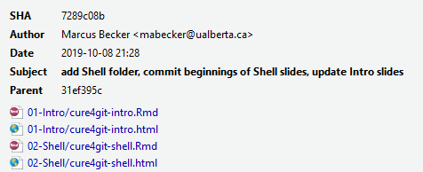
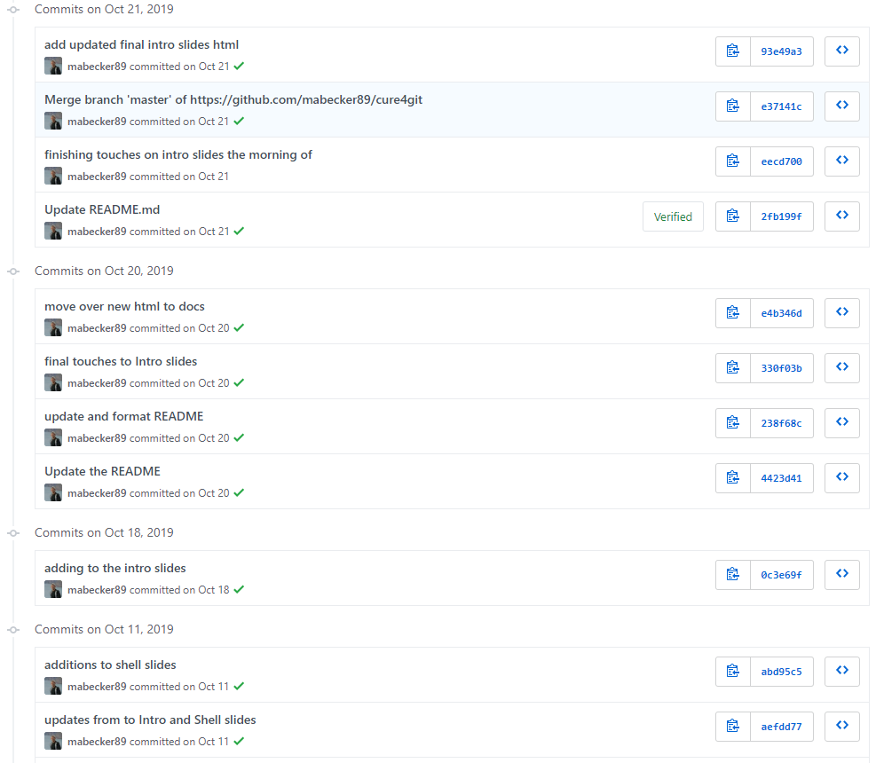
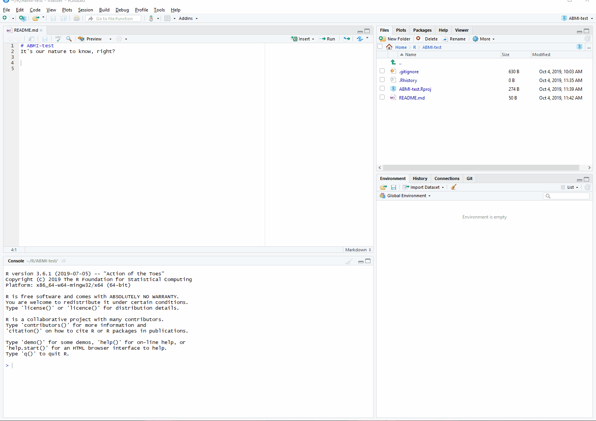
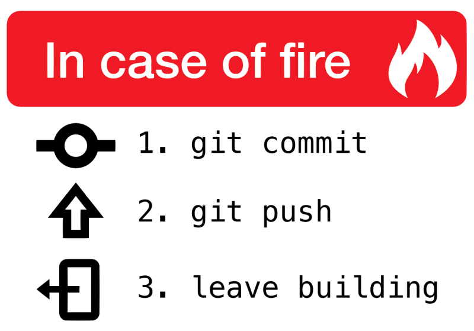

```{r setup, include = FALSE}

options(htmltools.dir.version = FALSE)

library(knitr)

opts_chunk$set(
  #prompt = T,
  fig.align="center", #fig.width=6, fig.height=4.5, 
  # out.width="748px", #out.length="520.75px",
  dpi=300, #fig.path='Figs/',
  cache=T#, echo=F, warning=F, message=F
  )

```

# Outline of these workshops

### Workshop 1 (Today! Right now!)
<br>
.font130[1. [Prologue](#prologue)

1. [Intro to Git](#git)
  
1. [Github](#github)

1. [Set up](#setup)

1. [RStudio Projects](#rstudio)]

---

# Outline of these workshops

### Workshop 2 (October 6)

- Troubleshoot some setup issues

- Get practice with basic workflows, collaborating with others

--

### Workshop 3 (October 13)

- Advanced concepts

- Extensions (organizations, teams, websites)

---
class: inverse, center, middle
name: prologue

# Prologue

<html><div style='float:left'></div><hr color='#EB811B' size=1px width=796px></html>

---

# Why bother?

<div align="center">

</div>

---

# The Pitch

### Our needs as researchers, data scientists, developers, etc:
<br>

.font110[1. **A structured way to manage our projects**.

2. **Ability to experiment with changes, and travel back in time if we need to.**

3. **Back up our work.**]

<br>
<br>


<div align="center">

</div>

---
count: false

# The Pitch

### Our needs as researchers, data scientists, developers, etc:
<br>

.font110[1. A structured way to manage our projects.

2. Ability to experiment with changes, and travel back in time if we need to.

3. Back up our work.

4. **Collaborate with others.**

5. **Publicize and share our work.**]

<div align="center">


</div>

---
class: inverse, center, middle
name: git

# Intro to Git
<html><div style='float:left'></div><hr color='#EB811B' size=1px width=796px></html>

---

# Git (in theory)

A **version control system** is a tool that manages changes made to files and directories in a project.

Many exist, but we'll focus on a particularly powerful one: **Git**.
> If Dropbox and Word's *Track Changes* feature had a baby, Git would be that baby.

--

<br>

Git is an application that runs on your machine, like a word processor or web browser, and manages the evolution of a set of files in a highly structured way.

Originally created to help groups of people develop software.

---
# Git (in theory)

### Why's it useful to us?

+ Nothing that is saved to Git is ever lost, unless you work really hard at it.
+ Synchronizes work done by different people on different machines (i.e., a method to manage a *distributed* workflow)
+ Well designed for writing and tracking changes to code.

---

# Key Git Terms (1)

### **Repository**

Git projects have two parts: the files and directories you create and edit directly, and the extra information that Git records about the project's history. 

The combination of these two things is called a **repository**, or *repo* as the cool kids say. 

### **Commit**

You use Git to take snapshots of all the files in a repository.

When you want to take a snapshot of a file or files, you create a **commit**.

<br>
So [why would I want to do this](https://speakerdeck.com/alicebartlett/git-for-humans?slide=23) silly commit thing instead of just regular 'ol saving?

---

# Commit (cont'd)

When you **commit** a file or files, some information is saved along with the changes to the file:

1. Who
2. When

Plus, you can (should!) add more information about the changes you've made in a **commit message**.

What's this look like?

--

<div align="right">

</div>

---

# Commit (cont'd)

You can also browse the entire **commit history** of a project.

<div align="center">

</div>

<br>

.footnote[
<sup>1</sup> There's a much [more fun way](http://starlogs.net/) to do this.]

---

# Commit (cont'd)

<div align="center">

</div>

---

# Key benefits (so far)

<br>
- Git stores the whole history of your project in a highly structured way.

- You can time travel to previous versions of your project if you need to.

---

# Key Git Terms (2)

### **Remote**

You should back up your work regularly, ideally somewhere geographically distinct from your computer.

With Git, repositories can be local (on your machine) or **remote**, i.e. hosted online by a service like Github (which we'll chat about right away).

--

How do you interact with a remote repository?

--

### **Clone**

To first retrieve work from a remote, you **clone** the repository onto your local computer.

Now you have a working copy, including the entire project history tracked by Git.

---

# Key Git Terms (3)

### **Pull**/**Push**<sup>1</sup>

Next, you'll want your local version to 'speak' seamlessly with the remote.  

A typical workflow:

  + You **pull** from a remote repository to make sure you have the latest version of everything locally.
  + You do some work, and **commit** it.
  + You **push** your new commits back to the remote repository so that it's backed up there and your collaborators can access it.

<br>
.footnote[
<sup>1</sup> These two commands were intentionally ordered in this way - it's good practice to Pull before you start work on a project, then Push when you're finished, even if you're working alone. If (when) you forget, there will be pain. Best to get in the habit.] 

---
# Git (in practice)

### One problem ... 

--

#### ... it's super unfriendly to use (at first)

<br>

<div align="center">

</div>

---

# Git (in practice)

<div align="center">

</div>

---

# Key benefits (so far)

<br>
- Git stores the whole history of your project in a highly structured way.

- You can time travel to previous versions of your project if you need to.

- **Use remote repositories to back up your project.**

---
class: inverse, center, middle
name: github

# Github
<html><div style='float:left'></div><hr color='#EB811B' size=1px width=796px></html>
---

# Github

**Git and Github are distinct things.**

  + [Github](https://www.github.com) is an online hosting platform that provides an array of services built on top of the Git system<sup>1</sup>.
  
  + We can create, manage permissions to, and store our files in repositories hosted by Github.
  
  + Just like we don't *need* RStudio to run R code, we don't *need* Github to use Git - but it makes our lives easier and we unlock many other benefits.
  
<div align="center">

</div>

.footnote[
<sup>1</sup> Other examples are Gitlab and Bitbucket.]

---

# Github for Scientific Research

In addition to the benefits of rigorous version control and collaboration tool, Git(hub) also helps to operationalize the ideals of open science and reproducibility.

  +  *Nature:* [Democratic databases: science on GitHub](https://www.nature.com/news/democratic-databases-science-on-github-1.20719) (Perkel, 2016).
  + *PLOS:* [Ten Simple Rules for Taking Advantage of Git and Github](https://journals.plos.org/ploscompbiol/article?id=10.1371/journal.pcbi.1004947) (Perez-Riverol et al 2016)

--

Journals are increasingly moving towards stricter requirements regarding reproducibility and data access. 

  + No more frustrating reads of a tiny Methods section in a dusty old pdf file of a paper where you're trying desperately to understand what they did, step-by-step (.. *breathes heavily* ..).
  + You can host all the data, code, and writing for papers, projects, and/or reports in one place. Even [workshop materials](https://github.com/ABbiodiversity/cure4git).

---

# Key benefits

<br>
- Git stores the whole history of your project in a highly structured way.

- You can time travel to previous versions of your project if you need to.

- Use remote repositories to back up your project.

- **Plenty of collaboration tools offered via Github** 

- **Ability to share your work with the world!**

---

# Key benefits (from an ABMI perspective)

<br>

- **Reproducibility**: We're a public organization, and it's important that we're transparent with our science.

- **Institutional knowledge**: We need to have ways to preserve the ongoing work of the organization in the event that staff leave.

- **Documentation**: Github provides easy ways to create keep track of, share, and update documentation.

- **Publicize our awesome projects**: Easily promote and create simple websites (for free!) for our work and projects (e.g., through Github Pages).

---
class: inverse, center, middle
name: setup

# Setup

<html><div style='float:left'></div><hr color='#EB811B' size=1px width=796px></html>

---

# Getting Started

.font80[Note: there are a ton of great Git resources online to you walk you through this process in depth. A bunch are listed in the [Resources](#resources) section at the back of this presentation and in the workshop's repo [README file](https://github.com/mabecker89/cure4git/blob/master/README.md), many of which are heavily borrowed from for this presentation.] 

### Register for a [Github](https://www.github.com) account.

  - It's free! Don't worry about the paid accounts for now<sup>1</sup>.

### Install Git on your local machine.

  - Depends on the OS you're running, but we'll assume Windows for this tutorial.
  - [Git for Windows](https://gitforwindows.org/), aka 'Git Bash', is a recommended approach.
  
.footnote[
<sup>1</sup> You'll qualify for an educational account while you work for ABMI/UofA, which means you can create an unlimited number of private repos.]

---

# Getting Started

### Introduce yourself to Git.

Directly in the Shell (Git Bash):

```bash
$ git config --global user.name 'Marcus Becker'
$ git config --global user.email 'mabecker@ualberta.ca'
```
  
Or through R:

```{r}
# install.packages("usethis")
  
library(usethis)
use_git_config(user.name = "Marcus Becker", 
               user.email = "mabecker@ualberta.ca")
```

<br>
<br>
Tips: Use your (real) full name, and the email associated with your Github account. 

---
# Getting Started

## Connect to Github

  - When we interact with a remote Git server, such as GitHub, we have to include credentials in the request.
  
  - This proves we are who we say we are!
  
  - Git can communicate with a remote server using one of two protocols, HTTPS or SSH, and the different protocols use different credentials.

--

  - Let's choose **HTTPS**.  

---

# Getting Started

### Connect to Github 
(with the **HTTPS** protocol)

Go to https://github.com/settings/tokens and click “**Generate token**”.<sup>1</sup>

.footnote[
<sup>1</sup> Look over the scopes; it's recommended to select “repo”, “user”, and “workflow”. These will be pre-selected if you used create_github_token().]

--

<br>

*or you can do it directly in R:*

```{r, include=TRUE, eval=FALSE}

# install.packages("usethis")
  
library(usethis)
usethis::create_github_token()

```

.footnote[
<sup>1</sup> Look over the scopes; it's recommended to select “repo”, “user”, and “workflow”. These will be pre-selected if you used create_github_token().]

---

# Getting Started

### Connect to Github 
(with the **HTTPS** protocol)

- Copy the token to your clipboard.

- Provide this token next time a Git operation asks for your password.<sup>1</sup>

.footnote[
<sup>1</sup> Note that it is this **Personal Access Token** (PAT) that is required; *not* your Github password that you use to login to the website.]

--

*or you can do it directly in R:*

```{r, , include=TRUE, eval=FALSE}

# install.packages("gitcreds")
  
library(gitcreds)
gitcreds::gitcreds_set()

```

---
class: inverse, center, middle
name: rstudio

# Project setup with R(Studio)

<html><div style='float:left'></div><hr color='#EB811B' size=1px width=796px></html>

---

# Seamless Integration 

A wonderful aspect of RStudio is how well it integrates version control into your project workflow.

Git is a separate program to R, but RStudio connects them so well that you feel they are part of the same ecosystem.

You can use Git through the RStudio GUI, and in the background it executes the shell commands for you.

---

# Seamless Integration

So let's ... git 'r done. 

<div align="center">

</div>

--

<div align="center">

</div>


---

# General Recipe

*For new projects*

1. Create a repo on GitHub and initialize with a README.

1. Copy the HTTPS link (access vis the green "Clone or Download" button).

1. In RStudio, create a new Project using the following steps: 

  `File -> New Project... -> Version Control -> Git` 
  
  and **clone** the repo to your local machine by pasting your copied link into the "Repository URL:" box.
  
1. Choose the project path (be intentional!) and click **Create Project**. 

<br>
> See the gif walkthrough on the next slide.

---

# General Recipe

<div align="center">

</div>

---

# General Recipe

We've now cloned a remote repo from Github onto our local machine. Yay!

Remember those important command terms? (**Stage, Commit, Pull**, and **Push**) <br>
Let's execute them (Well, let RStudio execute them for us). 

.font90[1. Make a change to the repo README in RStudio (add line of "Hello World!"). Save it.

1. Click the 'Git' tab in the `Environments, History, Connections .. ` pane.

1. Click `Commit`.

1. Click the `Stage` checkbox of the change you want to commit. 

  + You'll see a nice display of the changes you've either added (green) or deleted (red).

1. Write a `Commit message`. Be detailed. You never know when you'll need to know what you did in a particular commit. Commit the change.

1. Click `Pull` to retrieve any changes made by you or a collaborator in the upstream Github repo.

1. Click `Push`, which will send your changes to the remote repo on Github.] 

---

# General Recipe

<div align="center">

</div>

---

# Recap

### What did we just do?

.font80[
+ Made some changes to a file locally 
+ Staged these changes 
+ Committed these local changes to our Git history
+ Pulled from the remote repo upstream
+ Pushed our shiny new changes out into the remote repo, accessible to our collaborators
]

--

### Why this workflow?

.font80[
+ Allows Github to act as the central node in the distributed version control network.
+ Copying project from Github to your machine automatically sets up the local Git repo for you.
+ RStudio Projects interact seamlessly with Git and Github.
  - e.g. The .RProj file acts as an anchor point for all other files in the repo, solving absolute vs. relative path problems<sup>1</sup>.
  ]

.footnote[
<sup>1</sup> .font80[Please don't call files from `"YourComputer/YourName/Documents/SpecialPlace/Sub-Folder/myfile"` in your scripts. An angel loses its wings every time you do :)]]

---

# Other Workflows

<br>
<br>
.font120[New Project, Github First]
+ *This is what we just did.*

<br>
.font120[[Existing Project, Github First](https://happygitwithr.com/existing-github-first.html)]

<br>
.font120[[Existing Project, Github Last](https://happygitwithr.com/existing-github-last.html)]

---

# Repo tips

## README.md

+ You have the option to include a README when you create a repo in Github - do so!
+ README files act as landing pages for the repo, so you can (should) be explicit about the goals of the project/research, how to the run the analysis, etc. 
+ README's are written in [Markdown](https://www.markdownguide.org/), which Github automatically renders nicely for us.

## .gitignore

+ Tell Git what you want to ... ignore.
+ Useful if you have private files you would prefer not to be public (e.g. site location data).
+ Or for very large individual files (>100 MB). These will cause RStudio to 'hang' (i.e. freeze up) when you try to push them to a remote repo<sup>1</sup>, which you don't want.
+ Just a simple text file (save as .gitignore) in which you write the files you want ignored.  

.footnote[
<sup>1</sup> There are [ways to handle large files](https://git-lfs.github.com/) when you're working in the shell, though.]

---

# Next Workshop

### Homework:

+ Make a Github account if you don't have one.
+ Install Git on your local machine.
+ Say hello to Git.
+ Configure your Github credentials with a PAT.
+ Create a personal repository and make sure you can push/pull a few small changes.

If (when) you run into trouble, holler at Brandon or myself. We will help you troubleshoot. See the [Resources](#resources) slide for some awesome Git How-To's.

---

# Next Workshop

We will delve deep into some juicier Git topics! 
+ Troubleshoot any issues people had with set up. 
+ Introduce some more advanced concepts. 
---

# Resources

[Happy Git and GitHub for the useR](https://happygitwithr.com/)

+ This is an amazing guide for using Git and R together.

[Software Carpentry - Version Control with Git](https://swcarpentry.github.io/git-novice/)

+ A thorough walkthrough of all Git concepts.

[Git Immersion](http://gitimmersion.com/index.html)

+ A guided tour through the fundamentals of Git.

[Oh Shit, Git!](https://ohshitgit.com/)

+ For when you need a bit of humour during dark Git days.

---

# One last meme

<div align="center">

</div>

